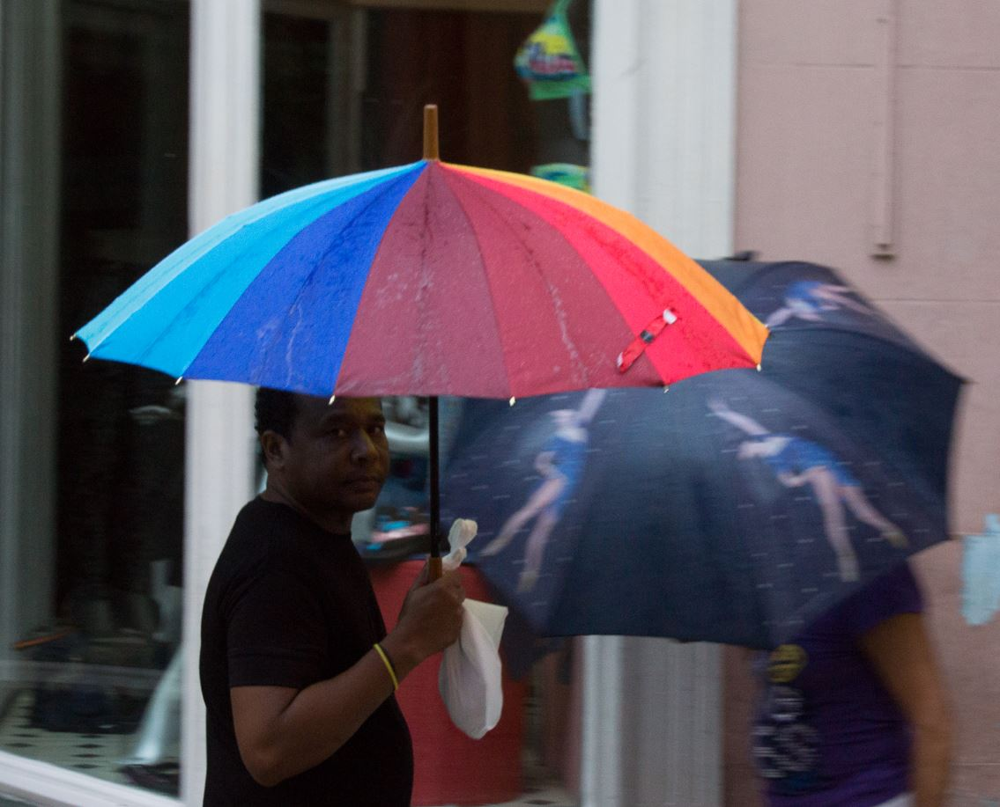
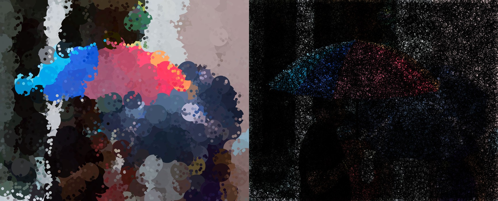

# My "One Pixel Camera"

This is the new version. It loads an image, and adjusts the window size automatically to that image, within given limts, of course,
and keeping the aspect ratio.

The sketch can also be found at [openprocessing](https://www.openprocessing.org/sketch/430564). This does work now, but see 
the bugs and fixes section if you are interested in my 'journey' with that. Note, that the left and right sections do overdraw
in the online version, while in the offline version, the clip() function is used to avoid this.

Any photos, except melbourneCity.jpg and nasaImage.jpg which are provided as course material, are copyrighted by Herbert Mehlhose.

## News

The newest topics are on top in this section.

### Next idea for recursion

What happens, if the right image source is taken after the rebuild phase has been run for some time and we take
this new images as a source for our algoritm? Doing a restart automatically with that image and doing it over
and over again... Curious on that, going ahead...

### Rebuilding right image

After a certain amount of frames has passed, so that the right image is almost completely black, a "rebuild"
is started, now drawing circls in the original scan color. Adds some nice effects, just start and wait. A message
is also written to the console, if that point is reached.

### About interaction

You can use the following keys to interact.

| Key | Function | Remark     |
|------------------------|-------------|-------------|
| s  | Save image           | Saves to 'onePixelCam*n*.jpg, numbering restarts with new run |
| p  | Pause execution | Useful to watch result, keep screenshot, change ellipse size |
| r  | Restart from beginning | Resets the frameCount to 0 (yes, it's possible :) |
| up  | Increase min. ellipse size | Max value is *maxDotSize* in code |
| down  | Decrease min. ellipse size | Minimum value is 1 |

Note, that ellipse size is not set statically, the change only affects the *minimum* size, and the actual
size is dynamically decreased from max to min with increasing frameCount.

### About resizing the frame

This first version jsut implements a way to automatically adjust your window size to the image loaded. I found, that
the size() function does not allow to use variables. 

The following code works fine
```
PImage i = loadImage(filename);
int imgWidth = i.width;
int imgHeight = i.height;
// ... process image including rescaling calculations for new imgWidth/height
i.resize(imgWidth, imgHeight);
surface.setSize(2*imgWidth, imgHeight);
```

Note, that this is not possible in the openprocessing Processing.js environment.

### Random sampling and reconstruction and adding interaction

The code now does a random scan of the image. The amount of samples taken per frame can be adjusted. The sampled points
are reconstructed with ellipses on the left, which start at a larger size and get smaller over time. In the end, it 
might end up in a complete reconstruction of the original image, depending on the minimum size for the ellipses.

The 'UP' or 'DOWN' keys can change the minimum ellipse during runtime, so after some time, you can produce larger
bubbles in your image.

Yu can use the 'p' key to pause the sketch. This is useful to watch your image and to take a screenshot with key 's'.
You also can pause the execution and change ellipse sizes.

My following picuture havanna2.JPG has been used



The following settings have been used to create the example picture below: 
```
int maxWidth = 1800;
int maxHeight = 700;
String imgfile = "havanna2.JPG";
int nScansPerFrame = 30;
int maxDotSize = 40;
int minDotSize = 20;
```
In addition I did pause the sketch, increased the ellipse size again, did run it a short time, paused again, decreased
ellipses, run again short time and then pause again and save. This way, large bubbles and small bubbles appear as shown below.



## TODOs

After loading ghe image in a more comfortable way, now the real stuff will begin...

## bugs and fixes

### openprocessing.org version now fixed

Code seems ok, but openprocessing.org version does not work for some reason. I did investigate this and found
that I need to change the openprocessing environment to *Processing.js* instead of the *P5.js* to which it was 
set by default for some reason. This results in the strange *missing ; before statement* error.

Next problem was now to load the image. It did not load correctly, reporting size 0. The solution here was to add
```
/* @pjs preload="havanna2.JPG"; */
```
as a preload directive. It now loaded correctly, but complains about *surface is not defined*. Digging into this led
me to the [Github processing article Window Size and Full Screen](https://github.com/processing/processing/wiki/Window-Size-and-Full-Screen).
It looks, like surface is not availabe in processing.js. Also the clip() function is not available.

So I proceeded for now to fix the code in [openprocessing](https://www.openprocessing.org/sketch/430564). This works 
with the original image and code has been adjusted for fixed window size.