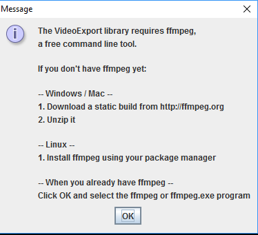
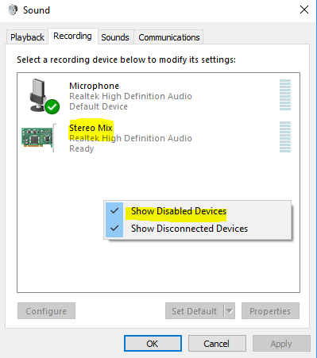

# My "One Pixel Sound Cinema" aka "Sound from Outer Space"

This is the new and improved version of the original one pixel cinema from the Futurelearn course.
It uses the originel melbourneCity.jpg and nasaImage.jpg which are provided as course material. See
license in upper directory.

The image "flaars.jpg" is copyright by Rich Clarke

## News
Added the following features

* You can now record a video from your image. This needs additional processing libs as well as ffmpeg, see description below.
* You can now select your image using a dialog. Also, using 'n' you can select a new image to be played.
* The window size is automatically matched. Note, that if you use 'n' to load a new image while recording
a video, this will produce rubbish, if the new image does not have the same size. In this case, only the
sound will be correct, but the video is distorted.


## Basic idea
I was inspired by the sound functions during the course, and found, that there are also functions,
which provide "kind of synthesizer" functionality, instead of only replaying sound files.
This made me come up with the idea to modify the original sketch, showing 10 sample points
as vertical bars on the left to also incorporate some sound.
For each of the sample points, a corresponding Sine Wave Oscillator has been defined, playing
a sine wave sound of a specific frequency and direction.

## Simple rules
The hue value of each sample point defines the frequency of its corresponding oscillator. In addition, 
I decided to introduce a "pan" value depending on the overall brightness of the sampled points.

Thus, dark pixels are "played" on the left, while "bright" ones go to the right. It's important to 
note, that the frequency is NOT dependent on the brightness, but only on the hue value.

Formula behing in current code:
```
    float hueval = (float)hue(pixelColors[i]);
    float brightval = (float)brightness(pixelColors[i]);
    float freq = map(hueval,0.0,255.0,80.0,1500.0);
    float pan = map(brightval,0.0,255.0,-1.0,1.0);
    sine[i].freq(freq);
    sine[i].pan(pan);
```
 
## About interaction

You can use the following keys to interact.

| Key | Function | Remark     |
|------------------------|-------------|-------------|
| 1-0 | Toggle sound for each channel on/off           | 1 = left column, 0 = right column. Inactive tracks are shown in black circles/bars|
| n | Restart by selecting a new image | |
| r | Start/Stop recording a video | This requires some libraries as well as ffmpeg to be installed |

Pressing 'r' will move the scanner points to the top again. Pressing 'r' again stops recording. Note, that
recording automatically stops, if the scaners reach the bottom of the image.

Note, that you will be prompted for the ffmpeg path the first time, you start the sketch.

If this prompt appears, just navigate to the ffmpeg.exe and select this. Afterwards, processing will remember
the path. In case, this prompt does not appear or you change the location of ffmpeg, you can uncomment the
following line in the sketch for the next single run to force that dialog to reappear.
```
//videoExport.forgetFfmpegPath();
```


## Selectable files via dialog
You can select a file using a dialog instead of the need to modify the code each time.


## My video capture adventure
This is not yet completely described here... I will improve the documentation.

Some example videos, that I did capture can be found here:

* [Fairground](https://www.dropbox.com/s/c7lzo2vfdpbh176/processing-movie-ball.mp4?dl=0)
* [Cheetah](https://www.dropbox.com/s/vp6h4v72w97f554/processing-movie-cheetah.mp4?dl=0)
* [Eagle](https://www.dropbox.com/s/7430suf7tqq9qnk/processing-movie-eagle.mp4?dl=0)
* [Hamburg](https://www.dropbox.com/s/n411oe8j4qwfch8/processing-movie-hamburg1.mp4?dl=0)
* [Pigeon](https://www.dropbox.com/s/2tjmd1ady1uaqcs/processing-movie-pigeon.mp4?dl=0)

First note, that I have done this only on my Windows 10 system. The challenge was to capture a video along with the
generated sound from the sketch.

The capturing of a video was a very intereting thing. I tried many options of how this could be done. I found, that
in previous versions, there was a library called Movie Maker, which is no longer available. Now going through
the [Available libraries for Processing](https://processing.org/reference/libraries/), there were 2 libraries of interest.

The [Minim Library](http://code.compartmental.net/minim/), which also could be a good alternative to generate my sine waves
instead of using the sound library as currently done in my sketch. 
See also [Problem with sound library](https://forum.processing.org/two/discussion/20452/why-error-node-set-control-input-index-2-out-of-range-for-synth-1) 
And for the video, there is the [Video Export library](https://www.funprogramming.org/VideoExport-for-Processing/). 

These libraries need to be installed first into your Processing libraries path, which can be done in the processing GUI. 
In addition, [ffmpeg](http://ffmpeg.zeranoe.com/builds/).

Looking into the documentation of Video Export, it turns out, that you only specify an existing sound file to be
put into the created video. Fortunately, looking at the source code shows, that this sound file is just added
at the end of the video capture, so it is possible to create a .wav file in parallel with _Minim_, saving that and
adding it to the video that's getting captured my _Video Export_ at the same time. This was the basic idea to start with.


## Problems that had to be solved
I ran into many problems until it finally did work as expected.

### Sound recording from sound output
The first problem was to make Minim record the produced output and not the microphone. I did quite some research
and finally came up with the following, which works with Windows 10. It requires to enable the _Stereo Mix_ recording device
to be enabled.



```
0: Primary Sound Driver
1: Speakers (Realtek High Definition Audio)
2: Primary Sound Capture Driver
3: Microphone (Realtek High Definition Audio)
4: Stereo Mix (Realtek High Definition Audio)
>>> Have set 'Stereo Mix (Realtek High Definition Audio)' as inputMixer
5: Port Speakers (Realtek High Definiti
6: Port Stereo Mix (Realtek High Defini
7: Port Microphone (Realtek High Defini
```

Note, that I have the following code in place, which will only accept a "Stereo Mix ..." named device.
```
String requiredMixerNameString = "Stereo Mix"; 
```


### non modal dialog for file selection

```
  // Note: the dialog window is started in a separate thread and is 
  // not modal, which means that the program does not wait for the user 
  // to select a file and instead just continues to run.
  // see https://forum.processing.org/one/topic/selectinput-selectoutput-in-processing-2-0-how-does-it-work.html
  // actually, this does not make any sense to me.
  // Setting myImg to null and just returning in draw() is one option, but
  // the sine waves are already started and this is annoying.
```

## TODO

Well, I'm not yet sure, if everything works fine. There seem to be some problems in the
sound library. Also need to check for options to save sound files. There are some links
on the web about "nimim"

### Checking for file existence

This is interesting. I found, that a simple try/catch with loadImage() does not work. Obviously, loadImage() does not
throw any exception if the file is not present and the application just crashes.

Another option I tried is to check for the existence of the file myself, before calling loadImage. This seems not to recognize
the relative path. But an absolute path makes no sense in code, if the sketch should run on other machines.

The next option is to use a file selection dialog using function selectInput(). Unfortunately, this opens
a dialog, that is not modal. The dialog is started in a separate thread, while the main program thread just continues
instead of waiting for the user to select the file. See [this entry in the processing forum](https://forum.processing.org/one/topic/selectinput-selectoutput-in-processing-2-0-how-does-it-work.html).
This does actually not make any sense to me, because a file dialog always should wait for me to select a file, before the program continues 
to work on that...

```
  // unfortunately, loadImage() does not seem to throw exceptions, so the
  // below code does not work...
  //try {
    //myImg = loadImage("nasaImage.jpg");
    //myImg = loadImage("flaars.jpg");
    //myImg = loadImage("melbourneCity.jpg");
  //}
  //catch (IOException e) {
  //  println("Error: " + e.getMessage());
  //  //e.printStackTrace();
  //}
  ```

### Making a video including sound

In addition, I would like to save a video. This is quite more interesting. Processing in fact
offers so many libraries, which can be easily included. One of them is "Video Export". It needs ffmpeg
to be installed and I tested this under Windows 10 successfully. The problem is, that it does not
capture the sound, but only allows to have sound added from an extra sound file.

Need to have a look at other options (nimim?) to capture sound as well, or to look into the Video Export
Java source, if it could be possible to have the sketch audio itself as source.

### Allow for different image sizes
You should be able to select images of any size.

## Problems and issues

### Sinus oscillator floods console with errors
The SinOsc floods the console with error messages. This seems to be related to stereo. It also happens with
the basic provided examples in processing sound. Therefore I switched to a triangle now, so that the console
output of the sketch remains readable.

### sound quality not pure sine
Sometimes, I found that sound is more like a sawtooth than a sine.. need to investigate, but 'n' for restart
and it's fine again...

### Failing captures
We might get the following, when recording is started, which is self explaining
```
VideoExport error: Width and height can only be even numbers when using the h264 encoder
but the requested image size is 1800x599
```
Although trying to correct and having even size reported, this still happens with some images...

